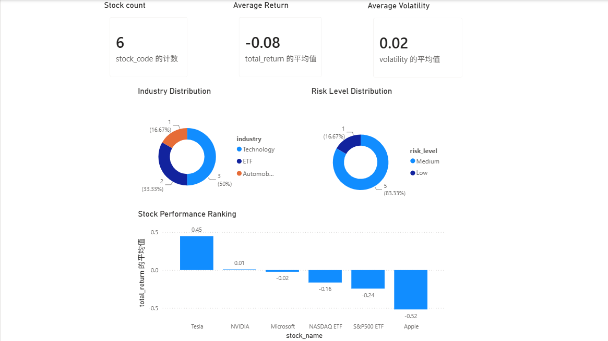
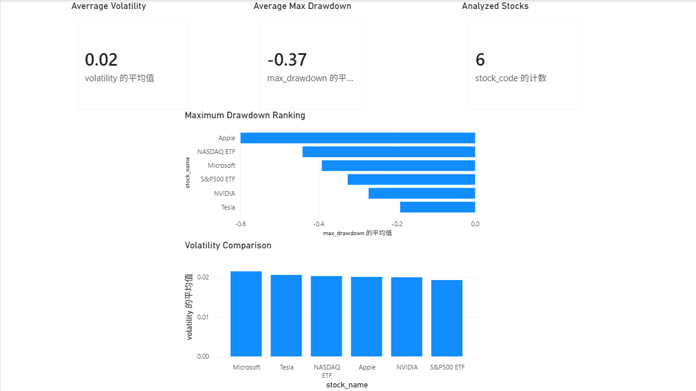
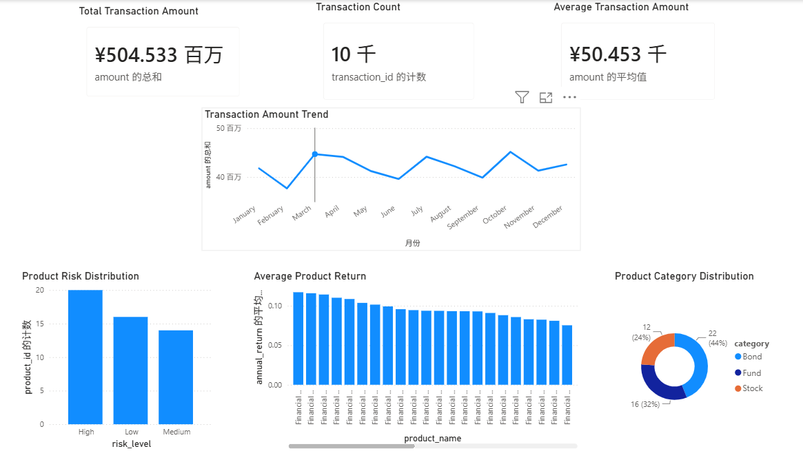
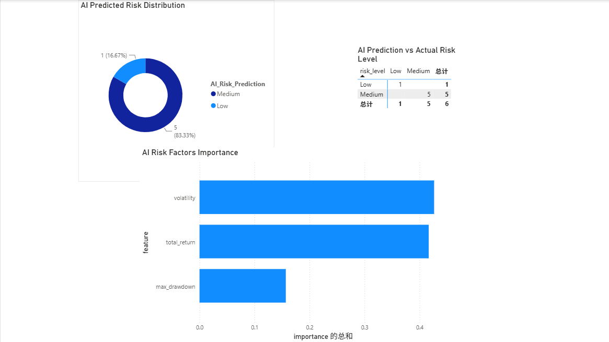

# AI Financial Market Analysis Platform

## Project Overview

AI Financial Market Analysis Platform is an end-to-end financial market analysis system built with Python, machine learning, MySQL 8.0, and Power BI. It processes market and transaction data, calculates stock risk indicators, generates AI-assisted risk classifications, and prepares data for database and dashboard exploration.

## Features

- Financial data processing and market-data preparation
- Stock return, volatility, and maximum-drawdown analysis
- AI risk prediction using a Random Forest classifier
- MySQL 8.0 schema creation, CSV loading, and validation queries
- Power BI dashboard integration point for business-facing visualization

## System Architecture

```text
Financial Data
      |
      v
Python Data Processing
      |
      v
Machine Learning Risk Model
      |
      v
MySQL Database
      |
      v
Power BI Dashboard
```

## Technology Stack

- Python
- Pandas and NumPy
- Scikit-learn
- SQL / MySQL 8.0
- Power BI
- Matplotlib and Seaborn

## Project Structure

```text
AI-Financial-Market-Analysis/
├── data/                       # Source data and generated analysis datasets
│   ├── market_data.csv
│   ├── transaction_data.csv
│   ├── product_data.csv
│   ├── stock_analysis_result.csv
│   └── ai_risk_prediction.csv
├── python/                     # Data fetching, cleaning, analysis, and ML scripts
│   ├── data_fetch.py
│   ├── data_clean.py
│   ├── analysis.py
│   ├── ai_risk_model.py
│   └── generate_test_data.py
├── sql/                        # MySQL 8.0 setup, import, analysis, and checks
│   ├── setup_database.sql
│   ├── create_tables.sql
│   ├── import_data.sql
│   ├── query.sql
│   └── check_database.sql
├── powerbi/                    # Place AI_Financial_Dashboard.pbix here
├── ai_report/                  # AI prediction artifacts and model documentation
│   ├── ai_risk_prediction.csv
│   ├── feature_importance.csv
│   └── model_description.md
├── screenshots/                # Dashboard and model-result screenshots
├── requirements.txt
└── README.md
```

## AI Model Description

The AI workflow reads `data/stock_analysis_result.csv` and uses `total_return`, `volatility`, and `max_drawdown` as model features. A `RandomForestClassifier` predicts the existing `risk_level` categories. Risk levels in the analysis pipeline are assigned from volatility: below 0.02 is Low, 0.02 to below 0.04 is Medium, and 0.04 or above is High.

Generated prediction output is saved as `data/ai_risk_prediction.csv` and archived in `ai_report/`. See `ai_report/model_description.md` for details.

## Database Design

The MySQL database is named `financial_analysis` and contains five tables:

- `market_data` — daily stock market records
- `transaction_record` — customer transaction records
- `financial_product` — financial product reference data
- `risk_analysis` — calculated stock-risk metrics
- `ai_risk_prediction` — machine-learning risk predictions

`sql/setup_database.sql` creates the schema and imports the project CSV files with Windows-compatible absolute paths. It uses MySQL-generated values for all `AUTO_INCREMENT` primary keys.

## Dashboard Description

The Power BI dashboard contains four pages for exploring market performance, risk metrics, trading behavior, and AI-generated risk classifications.

## Dashboard Preview

### Market Overview



This page provides a high-level view of market prices, trading volume, and stock performance trends.

### Risk Analysis



This page highlights volatility, maximum drawdown, and risk-level distributions across tracked stocks.

### Transaction Analysis



This page summarizes transaction activity by user, transaction type, and financial product.

### AI Risk Prediction



This page presents the model's risk predictions alongside the underlying return, volatility, and drawdown indicators.

## How To Run

1. Create and activate a virtual environment, then install dependencies:

   ```bash
   pip install -r requirements.txt
   ```

2. Run the analysis pipeline from the project root:

   ```bash
   python python/analysis.py
   python python/ai_risk_model.py
   ```

3. Enable MySQL local file loading (requires an appropriately privileged MySQL account), then run the database setup from PowerShell:

   ```powershell
   mysql -u root -p -e "SET GLOBAL local_infile = 1;"
   Get-Content -Raw .\sql\setup_database.sql | mysql --local-infile=1 -u root -p
   Get-Content -Raw .\sql\check_database.sql | mysql --local-infile=1 -u root -p
   ```

The MySQL client must be available on `PATH`. The import scripts use the Windows project path `D:/gitsyf/AI-Financial-Market-Analysis/data/`.

## Notes

This repository contains sample financial data for analysis and demonstration. It is not investment advice.
